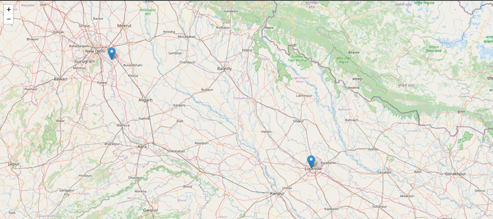

# Real-Time Map Tracker

This project implements a **real-time location tracker** similar to Uber or Zomato, using:
- **Express.js** for the backend server
- **Socket.IO** for real-time communication
- **Leaflet.js** for rendering the map

## Features
- Updates location **every second**
- Uses **WebSockets** for real-time updates
- Renders a **dynamic map** with Leaflet.js
- Supports **image display** for tracking or branding purposes

## Live Tracking image
-

## Installation
Run the following commands to install dependencies:

```bash
git clone https://github.com/yupAyush/Real-Time-Tracker
cd Real-Time-Tracker
npm install
